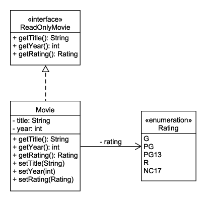

# Interfaces

An interface defines a contract that implementing classes must adhere to. Interfaces list methods that must be provided by classes that implement the interface.

Let's revisit our `Movie` class and add an interface to it:



In UML, an interface is often drawn the same as a class but with the keyword **interface** preceding the name.

The `ReadOnlyMovie` interface defines getter methods:

```java
public interface ReadOnlyMovie {
    Rating getRating();
    String getTitle();
    int getYear();
}
```

Since the `Movie` class implements the interface, it must provide those methods. Just like inheritance, it can also provide other methods.

You can create a `Movie` object like this:

```java
Movie movie = new Movie();
movie.setTitle("The Princess Bride");
movie.setYear(1987);
movie.setRating(Rating.PG);
```

You can cast it to a `ReadOnlyMovie` like this:

```java
ReadOnlyMovie readOnly = movie;
```

It is still a `Movie` object, but now users of the `readOnly` variable can only call methods defined by the `ReadOnlyMovie` interface. The getter methods return the property values, as expected:

```java
String title = readOnly.getTitle(); // returns "The Princess Bride"
int year = readOnly.getYear(); // returns 1987
Rating rating = readOnly.getRating(); // returns Rating.PG
```

However, the compiler will not let you call methods that are not defined by the `ReadOnlyMovie` interface. For example, attempts to call a setter will result in a compiler error:

```java
readOnly.setTitle("New Title"); // error!
// The method setTitle(String) is undefined for the type ReadOnlyMovie
```

Classes can implement more than one interface. For example, Java's `java.util.LinkedList` class implements the `List` and `Deque` interfaces, among others. These interfaces define methods to add, remove, and get items from the list. One annoying side effect of this design decision is that if you want to return a read-only version of a list, you need to wrap in a call to `Collections.unmodifiableList()`. This uses the Decorator design pattern (which we will learn about later) to wrap all methods and have methods like `add` and `remove` throw `UnsupportedOperationException`.

.NET avoids this issue by having the `System.Collections.Generic.List` class implement the `ICollection` interface (which defines add and remove operations) and the `IReadOnlyList` interface (which defines get operations). To return a read-only version of a `List`, cast it to `IReadOnlyList`.

This has been a very brief introduction to interfaces. They will become important later when we discuss design patterns.
